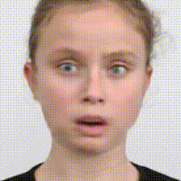
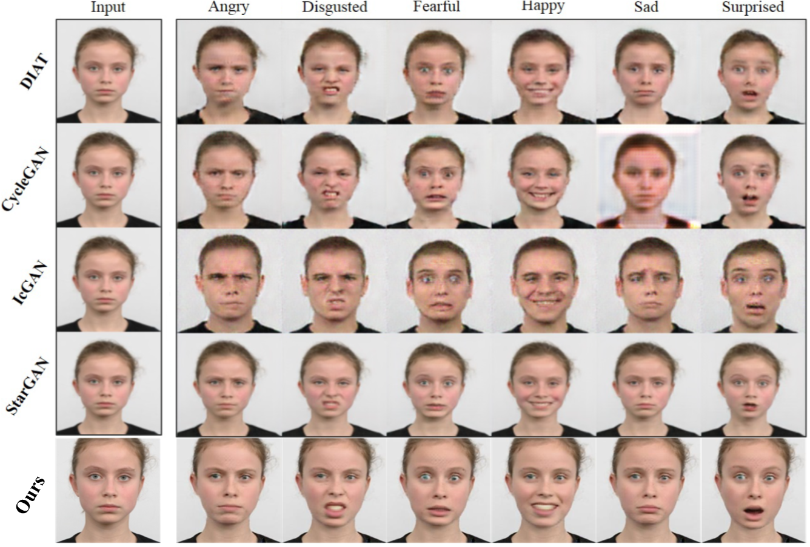
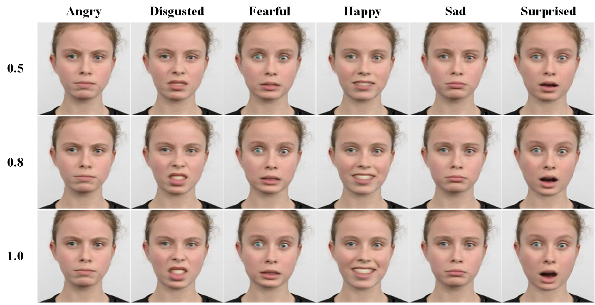

# 3D人脸重建，生成不同面部表情

> 在 [Deep3DFaceReconstruction](https://github.com/microsoft/Deep3DFaceReconstruction) 基础上进行不同表情重建。

## Code

在将来的某个时候开源代码。

## Results

### 连续效果

### 对比

### 渲染部分

### 重建部分

* 原始图像

* 原始重建效果：

  

